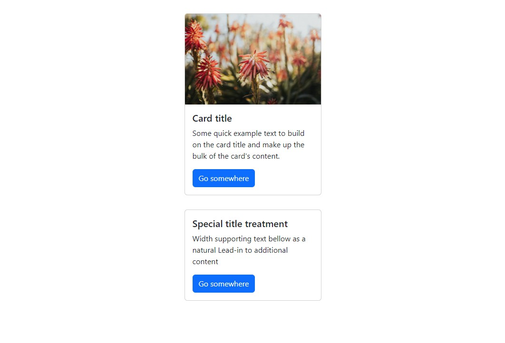

# Карточки

Учебный проект курса [React для JS-разработчиков](https://netology.ru/programs/react)

## **Задача**

Реализован компонент карточек, позволяющий использовать себя следующим образом:

В качестве CSS использован Bootstrap.

## **Стек технологий**

## [**Демо**](https://cards-umber-gamma.vercel.app/)

